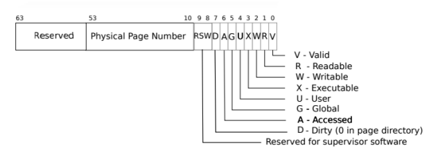
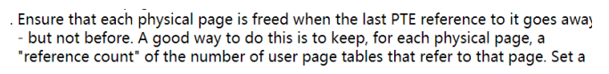
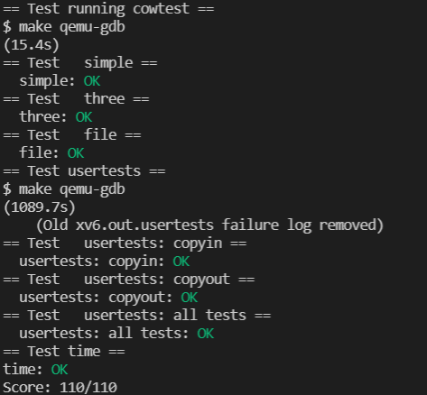

# Lab: Copy-on-Write Fork for xv6 

## 1. Implement copy-on write

In xv6, the implementation of fork() is to copy all the user space of the parent process to the user space of the child process. If the parent process address space is small, it is fine, but if it is too large, then this is very time-consuming. Also, fork() followed by exec() makes the copy operation in fork() meaningless. The purpose of this experiment is to complete copy on write and improve efficiency.



According to the xv6 book, PTE leaves two bits, one of which can be used as the COW flag. Add a macro definition to riscv.h following other flags.

```c
#define PTE_COW (1L << 8)
```

```c
int
uvmcopy(pagetable_t old, pagetable_t new, uint64 sz)
{
  pte_t *pte;
  uint64 pa, i;
  uint flags;

  for(i = 0; i < sz; i += PGSIZE){
    if((pte = walk(old, i, 0)) == 0)
      panic("uvmcopy: pte should exist");
    if((*pte & PTE_V) == 0)
      panic("uvmcopy: page not present");
    pa = PTE2PA(*pte);
    flags = PTE_FLAGS(*pte);

    *pte = ((*pte) & (~PTE_W)) | PTE_COW; // set parent's page unwritable
    if(mappages(new, i, PGSIZE, (uint64)pa, (flags & (~PTE_W)) | PTE_COW) != 0){
      goto err;
    }
    refcnt_incr(pa, 1);
  }
  return 0;

 err:
  uvmunmap(new, 0, i / PGSIZE, 1);
  return -1;
}
```



According to the experimental requirements, to save the number of page references, it is necessary to set up another array to record. Due to the problem of parallelism, that is, two processes refer to this array at the same time, some problems may occur at this time. So it needs to be locked. In fact, the refcnt_incr function in uvmcopy is the function that increases the number of page visits.

```c
struct {
  struct spinlock lock;
  struct run *freelist;
} kmem;

struct {
  struct spinlock lock;
  uint counter[(PHYSTOP - KERNBASE) / PGSIZE];
} refcnt;

inline
uint64
pgindex(uint64 pa){
  return (pa - KERNBASE) / PGSIZE;
}

inline
void
acquire_refcnt(){
  acquire(&refcnt.lock);
}

inline
void
release_refcnt(){
  release(&refcnt.lock);
}

void
refcnt_setter(uint64 pa, int n){
  refcnt.counter[pgindex((uint64)pa)] = n;
}

inline
uint
refcnt_getter(uint64 pa){
  return refcnt.counter[pgindex(pa)];
}

void
refcnt_incr(uint64 pa, int n){
  acquire(&refcnt.lock);
  refcnt.counter[pgindex(pa)] += n;
  release(&refcnt.lock);
}
```

The above are some auxiliary functions. For xv6, there are a total of (PHYSTOP - KERNBASE) / PGSIZE page tables, so the number of set locks is (PHYSTOP - KERNBASE) / PGSIZE.

The kfree function should also be modified to release the page when the number of references is 0. Because when the number of references is 0, it means that both processes have copied the old page, so kfree can be called to release the page.

```c
void
kfree(void *pa)
{
  struct run *r;

  // page with refcnt > 1 should not be freed
  acquire_refcnt();
  if(refcnt.counter[pgindex((uint64)pa)] > 1){
    refcnt.counter[pgindex((uint64)pa)] -= 1;
    release_refcnt();
    return;
  }

  if(((uint64)pa % PGSIZE) != 0 || (char*)pa < end || (uint64)pa >= PHYSTOP)
    panic("kfree");

  // Fill with junk to catch dangling refs.
  memset(pa, 1, PGSIZE);
  refcnt.counter[pgindex((uint64)pa)] = 0;
  release_refcnt();

  r = (struct run*)pa;

  acquire(&kmem.lock);
  r->next = kmem.freelist;
  kmem.freelist = r;
  release(&kmem.lock);
}
```

As required, the reference count should also be set to 1 when calling kalloc.

```c
void *
kalloc(void)
{
  struct run *r;

  acquire(&kmem.lock);
  r = kmem.freelist;
  if(r)
    kmem.freelist = r->next;
  release(&kmem.lock);

  if(r)
    memset((char*)r, 5, PGSIZE); // fill with junk

  if(r)
    refcnt_incr((uint64)r, 1); // set refcnt to 1
  return (void*)r;
}

void *
kalloc_nolock(void)
{
  struct run *r;

  acquire(&kmem.lock);
  r = kmem.freelist;
  if(r)
    kmem.freelist = r->next;
  release(&kmem.lock);

  if(r)
    memset((char*)r, 5, PGSIZE); // fill with junk
  
  if(r)
    refcnt_setter((uint64)r, 1); // set refcnt to 1

  return (void*)r;
}
```

Now start implementing cow. The implementation process actually refers to some source codes of kalloc.c and vm.c. When a process has a page table error, it only needs to check the PTE_COW bit. If there is a COW mark, then kalloc should be used to allocate a new page and copy the old page to the new page.

```c
int
cowcopy(uint64 va){
  va = PGROUNDDOWN(va);
  pagetable_t p = myproc()->pagetable;
  pte_t* pte = walk(p, va, 0);
  uint64 pa = PTE2PA(*pte);
  uint flags = PTE_FLAGS(*pte);

  // printf("w: %p %p %p\n", va, flags, *pte);

  if(!(flags & PTE_COW)){
    printf("not cow\n");
    return -2; // not cow page
  }

  acquire_refcnt();
  uint ref = refcnt_getter(pa);
  // printf("%d\n", *ref);
  if(ref > 1){
    // ref > 1, alloc a new page
    char* mem = kalloc_nolock();
    if(mem == 0)
      goto bad;
    memmove(mem, (char*)pa, PGSIZE);
    if(mappages(p, va, PGSIZE, (uint64)mem, (flags & (~PTE_COW)) | PTE_W) != 0){
      kfree(mem);
      goto bad;
    }
    refcnt_setter(pa, ref - 1);
  }else{
    // ref = 1, use this page directly
    *pte = ((*pte) & (~PTE_COW)) | PTE_W;
  }
  release_refcnt();
  return 0;

  bad:
  release_refcnt();
  return -1;
}
```

Finally, modify copyout and usertrap.

```c
    if(pte && (*pte & PTE_COW) != 0){
      // cow page
      if(cowcopy(va0) != 0){
        return -1;
      }
    }
```

```c
else if(r_scause() == 15){
    // page write fault
    uint64 va = r_stval();
    if(cowcopy(va) == -1){
      p->killed = 1;
    }
  } 
```

## 2. Result



