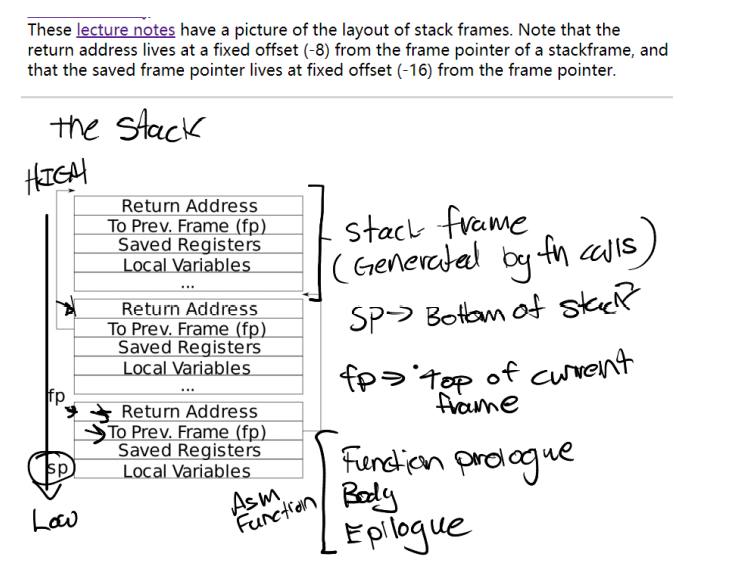
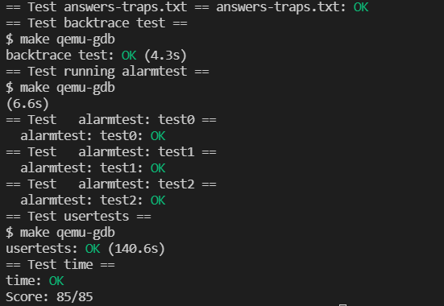

# Lab: traps

## 1. RISC-V assembly

Q1: Which registers contain arguments to functions? For example, which register holds 13 in main's call to printf?

A1:The function call process parameters of RISC-V use a total of 8 registers from a0 to a7. The return value is placed in the a0 and a1 registers. The parameter 13 of printf is stored in the a2 register.

Q2: Where is the call to function f in the assembly code for main? Where is the call to g? (Hint: the compiler may inline functions.

A2:Both of these are handled by inline optimization. The call to f in main uses the result 12 directly, and the call to function g in f is directly inlined in f.

Q3: At what address is the function printf located?

A3:0x630.

Q4: What value is in the register ra just after the jalr to printf in main?

A4:0x38.

Q5: Run the following code.

```c
unsigned int i = 0x00646c72;
printf("H%x Wo%s", 57616, &i);
```

What is the output? Here's an ASCII table that maps bytes to characters.

A5:He110 World; 0x726c6400.

Q6: In the following code, what is going to be printed after 'y='? (note: the answer is not a specific value.) Why does this happen?

```c
printf("x=%d y=%d", 3);
```

It will print the value of register a2, because printf will read the third parameter from the a2 register as the value of y.

## 2. Backtrace

```c
static inline uint64
r_fp()
{
	uint64 x;
	asm volatile("mv %0, s0" : "=r" (x) );
	return x;
}
```

The stack frame address can be obtained through this function.



In hints, the `return address` is at offset -8 of the stack pointer, and the saved frame pointer is at offset -16. That is to say, you only need to print out the address saved at fp-8, then jump to the address corresponding to fp-16, and keep recursing until you reach the address at the bottom of the stack. It should be noted that the stack grows from high address to low address, so use `PGROUNDUP` to get the bottom address of the stack.

```c
void
backtrace(void)
{
	uint64 fp = r_fp();
	uint64 up = PGROUNDUP(fp);
	uint64 ra;
	printf("backtrace:\n");
	while(fp != up){
		ra = *(uint64*)(fp - 8);
		printf("%p\n", ra);
		fp = *(uint64*)(fp - 16);
	}
}

```

## 3. Alarm

### 3.1 test0: invoke handler

Since `ticks`, `process's alarm handler`, and `interval` need to be recorded, three properties need to be added to proc struct for recording:

```c
int interval;
void (*handler)();
int ticks;
```

The function that `sys_sigalarm` needs to implement is to assign the interval and handler in the process. The value of interval is determined by p->trapframe->a0 (the return value of fn), and the value of handler is determined by p->trapframe->a1.

```c
uint64
sys_sigalarm(void)
{
	struct proc* p = myproc();
	int interval;
	uint64 handler;
	if(argint(0, &interval) < 0)
		return -1;
	if(argaddr(1, &handler) < 0)
		return -1;
	p->interval = interval;
	p->handler = (void(*)())handler;
	return 0;
}
```

Finally, according to the hints, the alarm related code should be added.

```c
    if(which_dev == 2){
    	p->ticks = p->ticks + 1;
    	if(p->ticks == p->interval){
    		p->ticks = 0;
    		p->trapframe->epc = (uint64)p->handler;
    	}
    	yield();
    }
```

### 3.2 test1/test2(): resume interrupted code

The context needs to be saved and restored after the interruption. According to the requirements and hints, it is easy to think that if you want to save the value of the register in the restoration process, you must have a backup. That is to say, the following backup information needs to be added to the PCB:

```c
  int is_in;
  uint64 his_epc;           
  uint64 his_ra;
  uint64 his_sp;
  uint64 his_gp;
  uint64 his_tp;
  uint64 his_t0;
  uint64 his_t1;
  uint64 his_t2;
  uint64 his_t3;
  uint64 his_t4;
  uint64 his_t5;
  uint64 his_t6;
  uint64 his_a0;
  uint64 his_a1;
  uint64 his_a2;
  uint64 his_a3;
  uint64 his_a4;
  uint64 his_a5;
  uint64 his_a6;
  uint64 his_a7;
  uint64 his_s0;
  uint64 his_s1;
  uint64 his_s2;
  uint64 his_s3;
  uint64 his_s4;
  uint64 his_s5;
  uint64 his_s6;
  uint64 his_s7;
  uint64 his_s8;
  uint64 his_s9;
  uint64 his_s10;
  uint64 his_s11;
```

`is_in` is a flag bit that indicates whether the function has reached the status of executable custom function. In fact, the stack frame trapframe structure can also be used instead. Using memcopy to directly copy the bit, it is easy to save and restore the context. But pay attention to freeing stack frame space.
	According to hints, in the sigreturn function, the previously saved state should be restored to the trapframe structure of the PCB, therefore:

```c
uint64
sys_sigreturn(void)
{
	struct proc* p = myproc();
	p->trapframe->epc = p->his_epc; 
  p->trapframe->ra = p->his_ra; 
  p->trapframe->sp = p->his_sp; 
  p->trapframe->gp = p->his_gp; 
  p->trapframe->tp = p->his_tp; 
  p->trapframe->a0 = p->his_a0; 
  p->trapframe->a1 = p->his_a1; 
  p->trapframe->a2 = p->his_a2; 
  p->trapframe->a3 = p->his_a3; 
  p->trapframe->a4 = p->his_a4; 
  p->trapframe->a5 = p->his_a5; 
  p->trapframe->a6 = p->his_a6; 
  p->trapframe->a7 = p->his_a7; 
  p->trapframe->t0 = p->his_t0; 
  p->trapframe->t1 = p->his_t1; 
  p->trapframe->t2 = p->his_t2; 
  p->trapframe->t3 = p->his_t3; 
  p->trapframe->t4 = p->his_t4; 
  p->trapframe->t5 = p->his_t5; 
  p->trapframe->t6 = p->his_t6;
  p->trapframe->s0 = p->his_s0;
  p->trapframe->s1 = p->his_s1;
  p->trapframe->s2 = p->his_s2;
  p->trapframe->s3 = p->his_s3;
  p->trapframe->s4 = p->his_s4;
  p->trapframe->s5 = p->his_s5;
  p->trapframe->s6 = p->his_s6;
  p->trapframe->s7 = p->his_s7;
  p->trapframe->s8 = p->his_s8;
  p->trapframe->s9 = p->his_s9;
  p->trapframe->s10 = p->his_s10;
  p->trapframe->s11 = p->his_s11;
  p->is_in = 1;
	return 0;
}
```

The last step is to back up the existing trapframe in user_trap.

```c
   if(which_dev == 2){
    	p->ticks = p->ticks + 1;
    	if(p->ticks == p->interval){
    	if(p->is_in){
    		p->is_in = 0;
    	  p->his_epc = p->trapframe->epc; 
        p->his_ra = p->trapframe->ra;
        p->his_sp = p->trapframe->sp;
        p->his_gp = p->trapframe->gp;
        p->his_tp = p->trapframe->tp;
        p->his_t0 = p->trapframe->t0;
        p->his_t1 = p->trapframe->t1;
        p->his_t2 = p->trapframe->t2;
        p->his_t3 = p->trapframe->t3;
        p->his_t4 = p->trapframe->t4;
        p->his_t5 = p->trapframe->t5;
        p->his_t6 = p->trapframe->t6;
        p->his_a0 = p->trapframe->a0;
        p->his_a1 = p->trapframe->a1;
        p->his_a2 = p->trapframe->a2;
        p->his_a3 = p->trapframe->a3;
        p->his_a4 = p->trapframe->a4;
        p->his_a5 = p->trapframe->a5;
        p->his_a6 = p->trapframe->a6;
        p->his_a7 = p->trapframe->a7;
        p->his_s0 = p->trapframe->s0;
        p->his_s1 = p->trapframe->s1;
        p->his_s2 = p->trapframe->s2;
        p->his_s3 = p->trapframe->s3;
        p->his_s4 = p->trapframe->s4;
        p->his_s5 = p->trapframe->s5;
        p->his_s6 = p->trapframe->s6;
        p->his_s7 = p->trapframe->s7;
        p->his_s8 = p->trapframe->s8;
        p->his_s9 = p->trapframe->s9;
        p->his_s10 = p->trapframe->s10;
        p->his_s11 = p->trapframe->s11;
    		p->ticks = 0;
    		p->trapframe->epc = (uint64)p->handler;
    	}
    	else
    		p->ticks -= 1;
    	}
    	yield();
    }
```

## 4. Result


