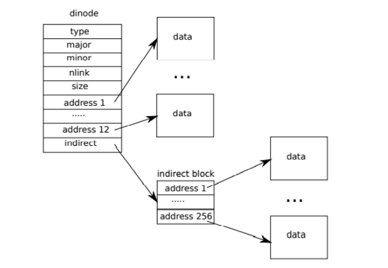
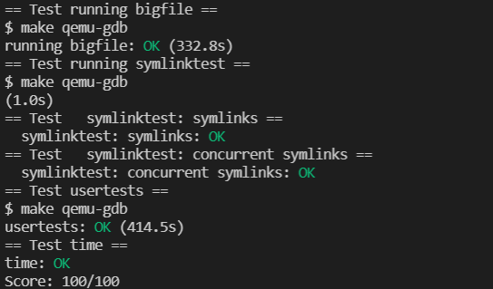

# Lab: file system

## 1. Large files



In the original file system of xv6, a dinode can store up to `12+256` data blocks. Therefore, you can try to replace one of address1~12 with a secondary address. In this way, there can be `11+256+256*256` data blocks. Therefore, the macro definition in `fs.h` needs to be modified. Because there are only `11` direct addresses now. At the same time, some macro definitions need to be added for convenience. Since the secondary address is introduced, the maximum number of data blocks of the secondary address is increased. The largest file data block also needs to be modified.

```c
#define NDIRECT 11
#define NINDIRECT_1 (BSIZE / sizeof(uint))
#define NINDIRECT_2 (NINDIRECT_1 * NINDIRECT_1  )
#define NINDIRECT (NINDIRECT_1 + NINDIRECT_2)
#define MAXFILE (NDIRECT + NINDIRECT)
```

But for a dinode, the stored addresses are still 13, so the addrs in the structure need to be modified. Similarly, the addrs in the inode of file.h should also be modified.

Now modify `bmap` to support secondary address access.

```c
static uint
bmap(struct inode *ip, uint bn)
{
  uint addr, *a;
  struct buf *bp;
  
  // printf("bmap:%d\n",bn);

  if(bn < NDIRECT){
    if((addr = ip->addrs[bn]) == 0)
      ip->addrs[bn] = addr = balloc(ip->dev);
    return addr;
  }
  bn -= NDIRECT;
  

  if(bn < NINDIRECT_1){
    // Load first-level indirect block, allocating if necessary.
    if((addr = ip->addrs[NDIRECT]) == 0)
      ip->addrs[NDIRECT] = addr = balloc(ip->dev);
    bp = bread(ip->dev, addr);
    a = (uint*)bp->data;
    if((addr = a[bn]) == 0){
      a[bn] = addr = balloc(ip->dev);
      log_write(bp);
    }
    brelse(bp);
    return addr;
  }

  bn -= NINDIRECT_1;

  if(bn < NINDIRECT_2){
    // Load second-level indirect block, allocating if necessary.
    if((addr = ip->addrs[NDIRECT+1]) == 0)
      ip->addrs[NDIRECT+1] = addr = balloc(ip->dev);
    bp = bread(ip->dev, addr);
    a = (uint*)bp->data;
    uint bn_1= ( bn / NINDIRECT_1) ;//level1 索引
    uint bn_2= bn % NINDIRECT_1;//level2 索引
    if((addr = a[bn_1]) == 0){
      a[bn_1] = addr = balloc(ip->dev);
      log_write(bp);
    }
    brelse(bp);
 
    bp = bread(ip->dev, addr);
    a = (uint*)bp->data;
    if((addr = a[bn_2]) == 0){
      a[bn_2] = addr = balloc(ip->dev);
      log_write(bp);
    }
    brelse(bp);

    return addr;
  }

  panic("bmap: out of range");
}
```

## 2 Symbolic links

- In `syscall.h`:

```c
#define SYS_symlink 22
```

- In `syscall.c`:

```c
extern uint64 sys_symlink(void);
[SYS_symlink] sys_symlink,
```

- In `usys.pl`:

```c
entry("symlink");
```

- In `user.h`:

```c
int symlink(char*, char*);
```

- In `stat.h`:

```c
#define T_SYMLINK 4
```

- In `fcntl.h`:

```c
#define O_NOFOLLOW 0x800
```

Now you need to modify the `sys_symlink` function, which is actually very simple, because you only need to create an inode of type T_SYMLINK, and then write the path of the file to this inode.

```c
uint64 
sys_symlink(void)
{
   char name[DIRSIZ],target[MAXPATH],path[MAXPATH];

   struct inode *dp,*ip ;

   if(argstr(0,target,MAXPATH) <0 || argstr(1,path,MAXPATH)<0)
   {
      return -1;
   }
    
   begin_op();
   //target does not need to exist for the system call
   // just store it in path inode's data block
   
   if((ip=namei(target)) != 0 && ip->type!=T_DIR  ) // it's ok if target doesn's exist
   {
      //if ip exist,increase nlink	   
      ilock(ip);
      ip->nlink++;
      iupdate(ip);
      iunlockput(ip);
   }
   

   if((dp = namei(path)) ==0 )//path对应inode节点不存在
   {
      if((dp=nameiparent(path,name))==0)//父目录也不存在
      {	      
         printf("NO inode corresponding to path's parent\n");	   
         goto bad;  
      }	 
      else
      {
         //利用create函数新建一个inode
         if((dp=create(path,T_SYMLINK,0,0))==0)// last two arguments are for T_DEVICE only
	   {
           printf("create symlink for path fail!\n");		 
	   goto bad;
	   }
	    else
	    {
	   iunlock(dp);
	     }
      }
   }

   ilock(dp);
   //store target in the end of directory dp's data block 
   writei(dp,0,(uint64)target,dp->size,MAXPATH);

   dp->type=T_SYMLINK;
   iunlockput(dp);
   
   end_op();
   return 0;


   bad:
     end_op();
     return -1;
}

```

Finally, sys_open needs to be modified, and the symbolic link processing needs to be added to the sys_open system call. When the mode is not O_NOFOLLOW, the symbolic link is processed circularly until the real file is found. It should be noted that there may be circular links, so the recursion needs to be terminated if the recursion exceeds a certain number of times. As prompted, recurse 10 times and it is considered a circular chain.

```c
uint64
sys_open(void)
{
  char path[MAXPATH];
  int fd, omode;
  struct file *f;
  struct inode *ip;
  int n;

  if((n = argstr(0, path, MAXPATH)) < 0 || argint(1, &omode) < 0)
    return -1;

  begin_op();

  if(omode & O_CREATE){
    ip = create(path, T_FILE, 0, 0);
    if(ip == 0){
      end_op();
      return -1;
    }
  } else {
    if((ip = namei(path)) == 0){
      end_op();
      return -1;
    }
    ilock(ip);
    if(ip->type == T_DIR && omode != O_RDONLY){
      iunlockput(ip);
      end_op();
      return -1;
    }
  }

  if(ip->type == T_DEVICE && (ip->major < 0 || ip->major >= NDEV)){
    iunlockput(ip);
    end_op();
    return -1;
  }

  if(ip->type == T_SYMLINK){
    if(!(omode & O_NOFOLLOW)){
      int cycle = 0;
      char target[MAXPATH];
      while(ip->type == T_SYMLINK){
        if(cycle == 10){
          iunlockput(ip);
          end_op();
          return -1; // max cycle
        }
        cycle++;
        memset(target, 0, sizeof(target));
        readi(ip, 0, (uint64)target, 0, MAXPATH);
        iunlockput(ip);
        if((ip = namei(target)) == 0){
          end_op();
          return -1; // target not exist
        }
        ilock(ip);
      }
    }
  }

  if((f = filealloc()) == 0 || (fd = fdalloc(f)) < 0){
    if(f)
      fileclose(f);
    iunlockput(ip);
    end_op();
    return -1;
  }

  if(ip->type == T_DEVICE){
    f->type = FD_DEVICE;
    f->major = ip->major;
  } else {
    f->type = FD_INODE;
    f->off = 0;
  }
  f->ip = ip;
  f->readable = !(omode & O_WRONLY);
  f->writable = (omode & O_WRONLY) || (omode & O_RDWR);

  if((omode & O_TRUNC) && ip->type == T_FILE){
    itrunc(ip);
  }

  iunlock(ip);
  end_op();

  return fd;
}
```

## 3. Result


