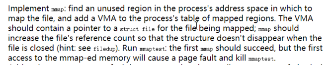
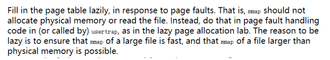
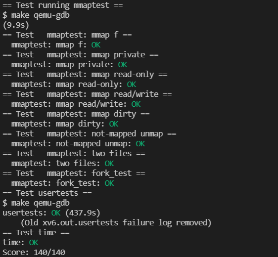

# Lab: mmap

## 1. mmap

In this lab need to add two system calls mmap and munmap. But first, there needs to be a virtual memory area structure to store memory mapping information.

In Linux, the vma is designed like this:

```c
struct vm_area_struct {
	struct mm_struct *vm_mm; /* associated mm_struct */
	unsigned long vm_start; /* VMA start, inclusive */
	unsigned long vm_end; /* VMA end , exclusive */
	struct vm_area_struct *vm_next; /* list of VMA's */
	pgprot_t vm_page_prot; /* access permissions */
	unsigned long vm_flags; /* flags */
	struct rb_node vm_rb; /* VMA's node in the tree */
    union { /* links to address_space->i_mmap or i_mmap_nonlinear
*/
	struct {
		struct list_head list;
		void *parent;
		struct vm_area_struct *head;
	} vm_set;
		struct prio_tree_node prio_tree_node;
	} shared;
	struct list_head anon_vma_node; /* anon_vma entry */
	struct anon_vma *anon_vma; /* anonymous VMA object */
	struct vm_operations_struct *vm_ops; /* associated ops */
	unsigned long vm_pgoff; /* offset within file */
	struct file *vm_file; /* mapped file, if any */
	void *vm_private_data; /* private data */
};

```

To complete a vma imitating the Linux system, of course, discarding many attributes that xv6 does not need:

```c
struct vma{
  uint64 start;
  uint64 end;
  uint64 length; // 0 means vma not used
  uint64 off;
  int permission;
  int flags;
  struct file *file;
  struct vma *next;

  struct spinlock lock;
};
```

Now we also need to do memory allocation for vma.

```c
struct vma* vma_alloc(){
  for(int i = 0; i < NVMA; i++){
    acquire(&vma_list[i].lock);
    if(vma_list[i].length == 0){
      return &vma_list[i];
    }else{
      release(&vma_list[i].lock);
    }
  }
  panic("no enough vma");
}
```



The function of the mmap system call is to apply for the allocation of a vma, find a piece of free memory, and fill in the relevant information into the vma. Then insert the vma into the vma list of the process.

```c
// allocate a new vma and insert it into link list
uint64
sys_mmap(void)
{
  uint64 addr;
  int length, prot, flags, fd, offset;
  if(argaddr(0, &addr) < 0 || argint(1, &length) < 0 || argint(2, &prot) < 0 || argint(3, &flags) < 0 || argint(4, &fd) < 0 || argint(5, &offset) < 0){
    return -1;
  }

  if(addr != 0)
    panic("wrong addr");
  if(offset != 0)
    panic("wrong offset");


  int pte_flag = PTE_U;
  struct proc *p = myproc();
  struct file* mapfile = p->ofile[fd];

  if (prot & PROT_WRITE) {
    if(!mapfile->writable && !(flags & MAP_PRIVATE)) 
    	return -1; 
    pte_flag |= PTE_W;
  }
  if (prot & PROT_READ) {
    if(!mapfile->readable) 
      return -1; 
    pte_flag |= PTE_R;
  }

  struct vma* new_vma = vma_alloc();
  // value copy
  new_vma->permission = pte_flag;
  new_vma->length = length;
  new_vma->off = offset;
  new_vma->file = myproc()->ofile[fd];
  new_vma->flags = flags;
  filedup(mapfile);
  struct vma* pv = p->vma;
  if(pv == 0){
    // create a link list
    new_vma->start = VMA_START;
    new_vma->end = new_vma->start + length;
    p->vma = new_vma;
  }else{
  	// insert into link list
    while(pv->next) pv = pv->next;
    new_vma->start = PGROUNDUP(pv->end);
    new_vma->end = new_vma->start + length;
    pv->next = new_vma;
    new_vma->next = 0;
  }
  addr = new_vma->start;
  release(&new_vma->lock);
  return addr;
}
```

The function of munmap is to find the corresponding vma structure from the linked list. Except for some illegal positions that cause errors, the found vma may be located at the head of the linked list, the tail of the linked list, or the entire linked list under normal circumstances. For different situations, write back, release or update vma information respectively.

```c
// find vma
uint64
sys_munmap(void)
{
  uint64 addr;
  int length;
  if(argaddr(0, &addr) < 0 || argint(1, &length) < 0){
    return -1;
  }

  struct proc *p = myproc();
  struct vma *v = p->vma;
  struct vma *pre = 0;
  while(v != 0){
    // found
    if(addr >= v->start && addr < v->end) 
      break;
    pre = v;
    v = v->next;
  }

  if(v == 0) 
    return -1;
  
  if(addr != v->start && addr + length != v->end) 
    panic("middle vma");

  if(addr == v->start){
    // write back
    writeback(v, addr, length);
    uvmunmap(p->pagetable, addr, length / PGSIZE, 1);
    if(length == v->length){
      // free
      fileclose(v->file);
      if(pre == 0){
        p->vma = v->next; 
      }else{
        pre->next = v->next;
        v->next = 0;
      }
      acquire(&v->lock);
      v->length = 0;
      release(&v->lock);
    }else{
      // free header
      v->start -= length;
      v->off += length;
      v->length -= length;
    }
  }else{
    // free tail
    v->length -= length;
    v->end -= length;
  }
  return 0;
}

```



```c
void
usertrap(void)
{
  int which_dev = 0;

  if((r_sstatus() & SSTATUS_SPP) != 0)
    panic("usertrap: not from user mode");

  // send interrupts and exceptions to kerneltrap(),
  // since we're now in the kernel.
  w_stvec((uint64)kernelvec);

  struct proc *p = myproc();
  
  // save user program counter.
  p->trapframe->epc = r_sepc();
  
  if(r_scause() == 8){
    // system call

    if(p->killed)
      exit(-1);

    // sepc points to the ecall instruction,
    // but we want to return to the next instruction.
    p->trapframe->epc += 4;

    // an interrupt will change sstatus &c registers,
    // so don't enable until done with those registers.
    intr_on();

    syscall();
  } else if(r_scause() == 15 || r_scause() == 13){
    
    struct vma* v = p->vma;
    uint64 va = r_stval();
  	while(v != 0){
    	if(va >= v->start && va < v->end){
    	  break;
    	}
    	v = v->next;
  	}
  	if(v == 0) 
  		goto bad;
  	
  	if(r_scause() == 13 && !(v->permission & PTE_R))
  		goto bad;
  	if(r_scause() == 15 && !(v->permission & PTE_W))
  		goto bad;
  	va = PGROUNDDOWN(va);
  	char* mem = kalloc();
  	if (mem == 0)
  		goto bad;
  	memset(mem, 0, PGSIZE);
  	if(mappages(p->pagetable, va, PGSIZE, (uint64)mem, v->permission) != 0)
  	{
    	kfree(mem);
    	goto bad;
  	}
  	struct file *f = v->file;
  	ilock(f->ip);
  	readi(f->ip, 0, (uint64)mem, v->off + va - v->start, PGSIZE);
  	iunlock(f->ip);
  	goto good;
  bad:
  	p->killed = 1;
  good:
  	;
  	
  } else if((which_dev = devintr()) != 0){
    // ok
  } else {
    printf("usertrap(): unexpected scause %p pid=%d\n", r_scause(), p->pid);
    printf("            sepc=%p stval=%p\n", r_sepc(), r_stval());
    p->killed = 1;
  }

  if(p->killed)
    exit(-1);

  // give up the CPU if this is a timer interrupt.
  if(which_dev == 2)
    yield();

  usertrapret();
}
```

The `writeback` function is to write back the page when needed. It can imitate the implementation of filewrite and write the data back to the corresponding file. According to `PTE_D`, it is judged whether the memory has been written. If it is not written, it has not been modified, and it does not need to be written back. The implementation here is relatively simple, which is to write back all pages directly.

```c
void
writeback(struct vma* v, uint64 addr, int n)
{
  if(!(v->permission & PTE_W) || (v->flags & MAP_PRIVATE)) 
    return;

  if((addr % PGSIZE) != 0)
    panic("unmap");


  struct file* f = v->file;

  int max = ((MAXOPBLOCKS-4) / 2) * BSIZE;
  int i = 0;
  while(i < n){
    int n1 = n - i;
    if(n1 > max)
      n1 = max;

    begin_op();
    ilock(f->ip);
    int r = writei(f->ip, 1, addr + i, v->off + v->start - addr + i, n1);
    iunlock(f->ip);
    end_op();
    i += r;
  }
}

```

Finally, you only need to copy the vma to the child process in the fork, release the vma list of the current process in exit, and write back the page:

```c
int
fork(void)
{
  int i, pid;
  struct proc *np;
  struct proc *p = myproc();

  // Allocate process.
  if((np = allocproc()) == 0){
    return -1;
  }

  // Copy user memory from parent to child.
  if(uvmcopy(p->pagetable, np->pagetable, p->sz) < 0){
    freeproc(np);
    release(&np->lock);
    return -1;
  }
  np->sz = p->sz;

  np->parent = p;

  // copy saved user registers.
  *(np->trapframe) = *(p->trapframe);

  // Cause fork to return 0 in the child.
  np->trapframe->a0 = 0;

  // increment reference counts on open file descriptors.
  for(i = 0; i < NOFILE; i++)
    if(p->ofile[i])
      np->ofile[i] = filedup(p->ofile[i]);
  np->cwd = idup(p->cwd);

  safestrcpy(np->name, p->name, sizeof(p->name));

  pid = np->pid;

  np->state = RUNNABLE;

  np->vma = 0;
  struct vma *pv = p->vma;
  struct vma *pre = 0;
  while(pv){
    struct vma *vma = vma_alloc();
    vma->start = pv->start;
    vma->end = pv->end;
    vma->off = pv->off;
    vma->length = pv->length;
    vma->permission = pv->permission;
    vma->flags = pv->flags;
    vma->file = pv->file;
    filedup(vma->file);
    vma->next = 0;
    if(pre == 0){
      np->vma = vma;
    }else{
      pre->next = vma;
    }
    pre = vma;
    release(&vma->lock);
    pv = pv->next;
  }

  release(&np->lock);

  return pid;
}

void
exit(int status)
{
  struct proc *p = myproc();

  if(p == initproc)
    panic("init exiting");

  // munmap all mmap vma
  struct vma* v = p->vma;
  struct vma* pv;
  while(v){
    writeback(v, v->start, v->length);
    uvmunmap(p->pagetable, v->start, PGROUNDUP(v->length) / PGSIZE, 1);
    fileclose(v->file);
    pv = v->next;
    acquire(&v->lock);
    v->next = 0;
    v->length = 0;
    release(&v->lock);
    v = pv;
  }

  // Close all open files.
  for(int fd = 0; fd < NOFILE; fd++){
    if(p->ofile[fd]){
      struct file *f = p->ofile[fd];
      fileclose(f);
      p->ofile[fd] = 0;
    }
  }

  begin_op();
  iput(p->cwd);
  end_op();
  p->cwd = 0;

  // we might re-parent a child to init. we can't be precise about
  // waking up init, since we can't acquire its lock once we've
  // acquired any other proc lock. so wake up init whether that's
  // necessary or not. init may miss this wakeup, but that seems
  // harmless.
  acquire(&initproc->lock);
  wakeup1(initproc);
  release(&initproc->lock);

  // grab a copy of p->parent, to ensure that we unlock the same
  // parent we locked. in case our parent gives us away to init while
  // we're waiting for the parent lock. we may then race with an
  // exiting parent, but the result will be a harmless spurious wakeup
  // to a dead or wrong process; proc structs are never re-allocated
  // as anything else.
  acquire(&p->lock);
  struct proc *original_parent = p->parent;
  release(&p->lock);
  
  // we need the parent's lock in order to wake it up from wait().
  // the parent-then-child rule says we have to lock it first.
  acquire(&original_parent->lock);

  acquire(&p->lock);

  // Give any children to init.
  reparent(p);

  // Parent might be sleeping in wait().
  wakeup1(original_parent);

  p->xstate = status;
  p->state = ZOMBIE;

  release(&original_parent->lock);

  // Jump into the scheduler, never to return.
  sched();
  panic("zombie exit");
}
```

## 2. Result


