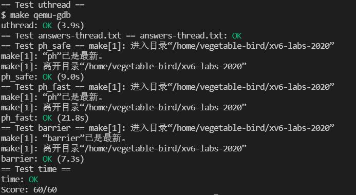

# Lab: Multithreading
## 1. Uthread: switching between threads

Thread switching needs to save and restore the register information, so we should add context information to the thread structure.

```c
struct thread {
	char stack[STACK_SIZE]; /* the thread's stack */
	int state; /* FREE, RUNNING, RUNNABLE */
	struct context threadContext;
};
```

Modify the `thread_create`  and `thread_schedule` . This is to create and restore thread state, so that the thread can be created when it was not created or restored to the state before it was switched.

```c
void 
thread_create(void (*func)())
{
  struct thread *t;

  for (t = all_thread; t < all_thread + MAX_THREAD; t++) {
    if (t->state == FREE) break;
  }
  t->state = RUNNABLE;
  // YOUR CODE HERE
  t->threadContext.ra = (uint64)func;
  t->threadContext.sp = (uint64)(t->stack) + STACK_SIZE;
}
```

```c
void 
thread_schedule(void)
{
  struct thread *t, *next_thread;

  /* Find another runnable thread. */
  next_thread = 0;
  t = current_thread + 1;
  for(int i = 0; i < MAX_THREAD; i++){
    if(t >= all_thread + MAX_THREAD)
      t = all_thread;
    if(t->state == RUNNABLE) {
      next_thread = t;
      break;
    }
    t = t + 1;
  }

  if (next_thread == 0) {
    printf("thread_schedule: no runnable threads\n");
    exit(-1);
  }

  if (current_thread != next_thread) {         /* switch threads?  */
    next_thread->state = RUNNING;
    t = current_thread;
    current_thread = next_thread;
    /* YOUR CODE HERE
     * Invoke thread_switch to switch from t to next_thread:
     * thread_switch(??, ??);
     */
     thread_switch(&t->threadContext, &current_thread->threadContext);
  } else
    next_thread = 0;
}
```

So the function declaration of thread_switch is modified to:

```c
extern void thread_switch(struct context*, struct context*);
```

The final step is to modify the assembly, store the thread state, and load the thread state:

```assembly
	.text

	/*
         * save the old thread's registers,
         * restore the new thread's registers.
         */

	.globl thread_switch
thread_switch:
	/* YOUR CODE HERE */
	sd ra, 0(a0)
	sd sp, 8(a0)
	sd s0, 16(a0)
	sd s1, 24(a0)
	sd s2, 32(a0)
	sd s3, 40(a0)
	sd s4, 48(a0)
	sd s5, 56(a0)
	sd s6, 64(a0)
	sd s7, 72(a0)
	sd s8, 80(a0)
	sd s9, 88(a0)
	sd s10, 96(a0)
	sd s11, 104(a0)
	ld ra, 0(a1)
	ld sp, 8(a1)
	ld s0, 16(a1)
	ld s1, 24(a1)
	ld s2, 32(a1)
	ld s3, 40(a1)
	ld s4, 48(a1)
	ld s5, 56(a1)
	ld s6, 64(a1)
	ld s7, 72(a1)
	ld s8, 80(a1)
	ld s9, 88(a1)
	ld s10, 96(a1)
	ld s11, 104(a1)
	ret    /* return to ra */

```

## 2. Using threads

This lab is actually implementing a thread-safe hash table by locking.

First, you need to define a mutex in ph.c. There are NBUCKET locks are needed.

```c
pthread_mutex_t lock[NBUCKET];
```

Initialize the lock in the main function:

```c
for(int i=0; i<NBUCKET; i++)
	pthread_mutex_init(&lock[i], NULL);
```

Finally, lock and unlock them on the `put`.

```c
static 
void put(int key, int value)
{
  int i = key % NBUCKET;

  // is the key already present?
  struct entry *e = 0;
  for (e = table[i]; e != 0; e = e->next) {
    if (e->key == key)
      break;
  }
  pthread_mutex_lock(&lock[i]);
  if(e){
    // update the existing key.
    e->value = value;
  } else {
    // the new is new.
    insert(key, value, &table[i], table[i]);
  }
  pthread_mutex_unlock(&lock[i]);
}

```

## 3. Barrier

The purpose of this experiment is to set a barrier so that all threads can continue to execute after reaching this point.
		It's actually very simple, every time you lock and increment the number of threads by one. If the number of threads is satisfied, then you can use `pthread_cond_broadcast` to wake up other threads, otherwise use `pthread_cond_wait` to continue waiting.

```c
static void 
barrier()
{
  // YOUR CODE HERE
  //
  // Block until all threads have called barrier() and
  // then increment bstate.round.
  //
  pthread_mutex_lock(&(bstate.barrier_mutex));
  bstate.nthread++;
  if(nthread == bstate.nthread){
  	bstate.nthread = 0;
  	bstate.round++;
  	pthread_cond_broadcast(&(bstate.barrier_cond));
  } else{
  	pthread_cond_wait(&(bstate.barrier_cond), &(bstate.barrier_mutex));
  }
  pthread_mutex_unlock(&(bstate.barrier_mutex));
}
```

## 4. Result



