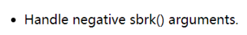
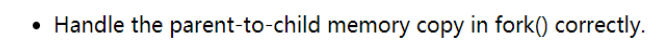
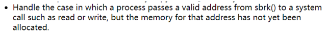
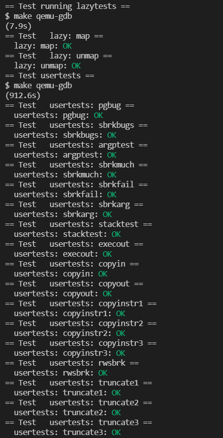
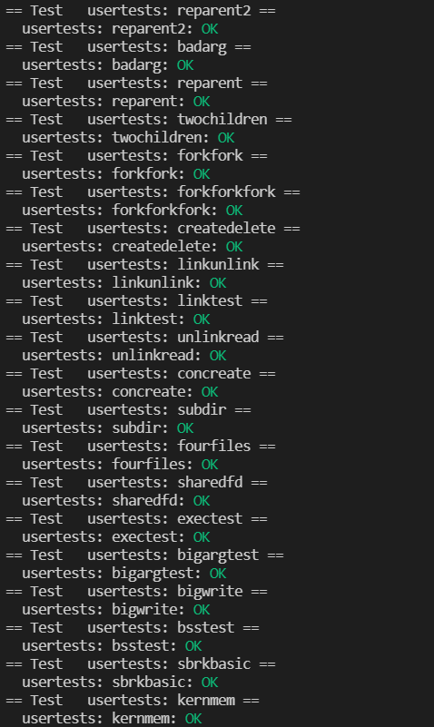
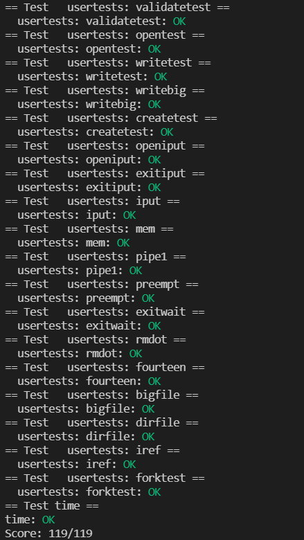

# Lab: xv6 lazy page allocation

## 1. Eliminate allocation from sbrk()

Very easy. Note that you should not forget to increment the process's size.

```c
uint64
sys_sbrk(void)
{
	int addr;
	int n;
	if(argint(0, &n) < 0)
		return -1;
	addr = myproc()->sz;
	myproc()->sz += n;
	//if(growproc(n) < 0)
		//return -1;
	return addr;
}

```

## 2.  Lazy allocation

In the first lab, the addresses requested by the user are still in an inaccessible state, so when these addresses are accessed, a page fault exception will be triggered and trapped in the kernel. Now, we need to handle this page fault in usertrap.

In the event of a page fault exception, the value of cause is 13 or 15. At the same time, the value of stval is the address of the legal exception, so it is only necessary to reassign the address at this time. When assigning, you should consider whether the assigned address is legal.
		There are mainly the following factors:

- The address should not exceed the process size
- The address cannot be below stack address
- The new address allocated by calling `kalloc` cannot be 0

We add a new function to handle this：

```c
int
lazy_alloc(uint64 addr) {
  struct proc *p = myproc();
  if (addr >= p->sz || addr < p->trapframe->sp){
    return -1;
  }

  uint64 pa = PGROUNDDOWN(addr);
  char* mem = kalloc();
  if (mem == 0) {
    return -1;
  }
  
  memset(mem, 0, PGSIZE);
  if(mappages(p->pagetable, pa, PGSIZE, (uint64)mem, PTE_W|PTE_X|PTE_R|PTE_U) != 0){
    kfree(mem);
    return -1;
  }
  return 0;
}
```

Memory allocation is performed when the scare value in the usertrap function is 13 or 15.

```c
else if (r_scause() == 13 || r_scause() == 15) {
    uint64 addr = r_stval();
    if (lazy_alloc(addr) < 0) {
      p->killed = 1;
    }
}
```

Finally, in the uvmunmap function, comment out the panic section.

```c
    if((pte = walk(pagetable, a, 0)) == 0)
      continue;
      // panic("uvmunmap: walk");
    if((*pte & PTE_V) == 0)
      continue;
      //panic("uvmunmap: not mapped");
```

## 3. Lazytests and Usertests

In this part, it is actually to increase the robustness of the program, so that the memory allocation function can complete the task in some special cases.



```c
uint64
sys_sbrk(void)
{
  int addr;
  int n;
  if(argint(0, &n) < 0)
    return -1;

  struct proc *p = myproc();
  addr = p->sz;
  p->sz += n;
  if(n < 0) {
    p->sz = uvmdealloc(p->pagetable, addr, addr + n);
  }
  // if(growproc(n) < 0)
  //  return -1;
  return addr;
}
```



According to hints, to correctly handle the address copy of the fork function, the call in fork is actually uvmcopy, so just replace the panic part of uvmcopy with continue.

```c
int
uvmcopy(pagetable_t old, pagetable_t new, uint64 sz)
{
  pte_t *pte;
  uint64 pa, i;
  uint flags;
  char *mem;

  for(i = 0; i < sz; i += PGSIZE){
    if((pte = walk(old, i, 0)) == 0)
      continue;
      // panic("uvmcopy: pte should exist");
    if((*pte & PTE_V) == 0)
      continue;
      // panic("uvmcopy: page not present");
    pa = PTE2PA(*pte);
    flags = PTE_FLAGS(*pte);
    if((mem = kalloc()) == 0)
      goto err;
    memmove(mem, (char*)pa, PGSIZE);
    if(mappages(new, i, PGSIZE, (uint64)mem, flags) != 0){
      kfree(mem);
      goto err;
    }
  }
  return 0;

 err:
  uvmunmap(new, 0, i / PGSIZE, 1);
  return -1;
}
```



This hint requires to deal with the situation when read and write operations are performed on invalid addresses, which obviously only needs to be dealt with when a page is missing. The access to the page table is dependent on the walkaddr function, so it only needs to be allocated when the walkaddr function is missing a page, that is, when the pte entry is abnormal. Call the walk function after allocation to get the correct page table entry.

```c
uint64
walkaddr(pagetable_t pagetable, uint64 va)
{
  pte_t *pte;
  uint64 pa;

  if(va >= MAXVA)
    return 0;

  pte = walk(pagetable, va, 0);
  if(pte == 0 || (*pte & PTE_V) == 0) {
    if (lazy_alloc(va) == 0) {
      pte = walk(pagetable, va, 0);
    } else {
      return 0;
    }
  }
  if((*pte & PTE_U) == 0)
    return 0;
  pa = PTE2PA(*pte);
  return pa;
}
```

Other requirements have been satisfied in `lazy_alloc`.

## 4. Result







