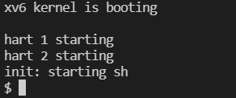
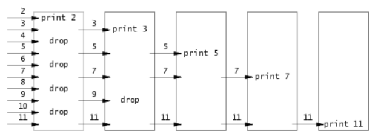
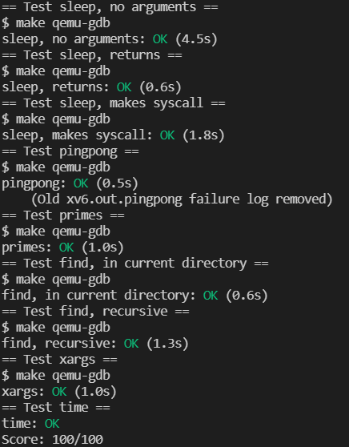

# Lab: Xv6 and Unix utilities

## 1. Boot xv6

​	Type `make qemu` on the command line to boot xv6.



## 2. sleep

​	In this lab, the use of the sleep system call is mainly investigated. According to `int sleep(int n)`, it is easy to know that you only need to pass the parameters entered on the command line into the sleep function. However, since the parameters passed in the command line are all string types, the strings need to be converted into integers. There are some auxiliary functions in xv6, of which the `atoi` function can assist in the realization of sleep.

```c
#include "kernel/types.h"
#include "kernel/stat.h"
#include "user/user.h"

int
main(int argc, char *argv[])
{
  if(argc < 2){
    fprintf(2, "Usage: sleep time...\n");
    exit(1);
  }
  int sleep_time = atoi(argv[1]);
  sleep(sleep_time);
  exit(0);
}
```

## 3. pingpong

​	In this lab, it is required to write a program that uses a system call to transfer a byte between two processes using a pair of pipes.

​	The pipe in xv6 is one-way communication, so two pipes are required. One is written by the parent process and read by the child process; the other is written by the child process and read by the parent process. After creating two pipes, fork a child process. In the child process, try to read the value passed in from the parent process from the pipe. If it is abnormal, stop the program. Otherwise, print out the pid and "received ping", and pass the value to the parent process through the pipe. If the abnormality also terminates the program.

​	The parent process is the same as the child process, but wait(0) is added to ensure that the child process can be fully executed.

​	However, you should know a feature about ***pipe***: **If a process tries to read before something is written to the pipe, the process is suspended until something is written.** [some knowledge about pipe](https://www.geeksforgeeks.org/pipe-system-call/)

​	For now, you should understand why `printf("%d: received ping\n", getpid());` is in that position.

```c
#include "kernel/types.h"
#include "kernel/stat.h"
#include "user/user.h"

int
main(int argc, char *argv[])
{
  int parent_pipe[2];
  int child_pipe[2];
  pipe(parent_pipe);
  pipe(child_pipe);
  char message[] = {"6"};
  
  // child process
  if(fork() == 0){
    close(parent_pipe[1]);
    close(child_pipe[0]);
    if(read(parent_pipe[0], message, 1) != 1){
      fprintf(2, "read error\n");
      exit(1);
    }
    printf("%d: received ping\n", getpid());
    if(write(child_pipe[1], message, 1) != 1){ 
      fprintf(2, "write error\n");
      exit(1);
    }
    exit(0);
  } 
  close(parent_pipe[0]);
  close(child_pipe[1]);
  if(write(parent_pipe[1], message, 1) != 1){
    fprintf(2, "write error\n");
    exit(1);
  }
  if(read(child_pipe[0], message, 1) != 1){
    fprintf(2, "read error\n");
    exit(1);
  }
  printf("%d: received pong\n", getpid());
  wait(0);
  exit(0);
}

```

## 4. primes



The core idea of this lab is shown in the figure above, which is actually the implementation of the Ehrlich sieve method through pipe. The core idea is that a process receives data from its left process, filters it, and then passes it to the next process, so you can consider using recursion to implement the program. Note that arrays start at 2. In addition, the integer type is four bytes, and the value returned when calling the write and read system calls should be 4.

```c
#include "kernel/types.h"
#include "kernel/stat.h"
#include "user/user.h"
void filter(int* primes, int n){
    printf("prime %d\n", primes[0]);
    if(n == 1)
        return;
    int p[2];
    pipe(p);
    int count = 0;
    for(; count<n; count++){
        if(primes[count] % primes[0])
            write(p[1], primes + count, 4);
    }
    close(p[1]);
    if(fork()==0){
        int number;
        int offset = 0;
        while (read(p[0], &number, 4) == 4)
        {
            *(primes + offset) = number;
            offset++;
        }
        filter(primes, offset);
        // terminate the child process
        exit(0);
    }
    wait(0);
}
int main(int argc, char *argv[])
{
    int primes[34];
    for(int i=2; i<=35; i++){
        primes[i - 2] = i;
    }
    filter(primes, 34);
    exit(0);
}
```

## 5. find

This lab mainly imitates the code in `user/ls.c`. For file search, depth-first search can be used. If the current search is a file, then directly use `strcmp` to compare whether the name of the target file and the current file are the same; if the search is a folder, you should enter the folder to continue the search (recursive). File types are differentiated using macros in xv6.

```c
#include "kernel/types.h"
#include "kernel/stat.h"
#include "user/user.h"
#include "kernel/fs.h"

char*
fmtname(char *path)
{
  static char buf[DIRSIZ+1];
  char *p;
  // Find first character after last slash.
  for(p=path+strlen(path); p >= path && *p != '/'; p--)
    ;
  p++;

  // Return blank-padded name.
  if(strlen(p) >= DIRSIZ)
    return p;
  memmove(buf, p, strlen(p)+1);

  // memset(buf+strlen(p), ' ', DIRSIZ-strlen(p));
  return buf;
}

void
find(char *path, char *tgt_file)
{
  char buf[512], *p;
  int fd;
  struct dirent de;
  struct stat st;


  if((fd = open(path, 0)) < 0){
    fprintf(2, "ls: cannot open %s\n", path);
    return;
  }

  if(fstat(fd, &st) < 0){
    fprintf(2, "ls: cannot stat %s\n", path);
    close(fd);
    return;
  }

  switch(st.type){
  case T_FILE:
		// printf("%s:%d\n", fmtname(path), strlen(fmtname(path)));
		// printf("%d %s %s\n", strcmp(fmtname(path), tgt_file), fmtname(path), tgt_file);
		if(!strcmp(fmtname(path), tgt_file)){
			printf("%s\n", path);
		}
    break;

  case T_DIR:
    if(strlen(path) + 1 + DIRSIZ + 1 > sizeof buf){
      printf("ls: path too long\n");
      break;
    }
    strcpy(buf, path);
    p = buf+strlen(buf);
    *p++ = '/';
    while(read(fd, &de, sizeof(de)) == sizeof(de)){
			if(!strcmp(de.name, ".") || !strcmp(de.name, ".."))
				continue;
      if(de.inum == 0)
        continue;

      memmove(p, de.name, strlen(de.name));
      p[strlen(de.name)] = 0;
      if(stat(buf, &st) < 0){
        printf("ls: cannot stat %s\n", buf);
        continue;
      }
			
			find(buf, tgt_file);
      // printf("%s %d %d %d\n", fmtname(buf), st.type, st.ino, st.size);
    }
    break;
  }
  close(fd);
}

int
main(int argc, char *argv[])
{

  // if(argc < 2){
  //   find(".");
  //   exit(0);
  // }
  // for(i=1; i<argc; i++)
  //   find(argv[i]);
	find(argv[1], argv[2]);
  exit(0);
}

```

## 6. xargs

The purpose of this lab is to take each line output by the previous command as arguments, by virtue of the instruction after xargs. `xargs` is executing two processes, so use `read` to read the output of the other process from the pipe. After splicing all the parameters, call `exec` to successfully implement xargs.

```c
#include "kernel/types.h"
#include "user/user.h"
#include "kernel/param.h"
int main(int argc, char *argv[])
{
	char* args[MAXARG];
  int args_length = 0;
	for(int i=1; i < argc; i++)
		args[args_length++] = argv[i];
	char block[32];
	char buffer[32];
  char* p = buffer;
  int offset = 0;

	int len;
	while((len = read(0, block, sizeof(block))) > 0)
	{
    for(int i=0; i<len; i++){
      // '\n' appears
      if(block[i] == '\n'){
        buffer[offset] = 0;
        offset = 0;
        args[args_length++] = p;
        p = buffer;
        args[args_length] = 0;
        args_length = argc - 1;
        if(fork() == 0){
          exec(argv[1], args);
          exit(0);
        }
        wait(0);
      }
      else if(block[i] == ' '){
        buffer[offset++] = 0;
        args[args_length] = p;
        p = buffer + offset;
      }
      else{
        buffer[offset++] = block[i];
      }
    }
	}
	exit(0);
}
```

## 7. Optional Challenge

- Write an uptime program that prints the uptime in terms of ticks using the `uptime` system call.

```c
#include "kernel/types.h"
#include "kernel/stat.h"
#include "user/user.h"
int
main(int argc, char *argv[])
{
    printf("uptime: %d\n", uptime());
    exit(0);
}

```

- Support regular expressions in name matching for `find`.  `grep.c` has some primitive support for regular expressions.

Replace `strcmp` with `match` in `grep.c`.

```c
#include "kernel/types.h"
#include "kernel/stat.h"
#include "user/user.h"
#include "kernel/fs.h"

int match(char*, char*);

char*
fmtname(char *path)
{
  static char buf[DIRSIZ+1];
  char *p;
  // Find first character after last slash.
  for(p=path+strlen(path); p >= path && *p != '/'; p--)
    ;
  p++;

  // Return blank-padded name.
  if(strlen(p) >= DIRSIZ)
    return p;
  memmove(buf, p, strlen(p)+1);

  // memset(buf+strlen(p), ' ', DIRSIZ-strlen(p));
  return buf;
}

void
find(char *path, char *tgt_file)
{
  char buf[512], *p;
  int fd;
  struct dirent de;
  struct stat st;


  if((fd = open(path, 0)) < 0){
    fprintf(2, "ls: cannot open %s\n", path);
    return;
  }

  if(fstat(fd, &st) < 0){
    fprintf(2, "ls: cannot stat %s\n", path);
    close(fd);
    return;
  }

  switch(st.type){
  case T_FILE:
    // without regular expressions
		// if(!strcmp(fmtname(path), tgt_file)){
    // support regular expressions
    if(match(fmtname(path), tgt_file)){
			printf("%s\n", path);
		}
    break;

  case T_DIR:
    if(strlen(path) + 1 + DIRSIZ + 1 > sizeof buf){
      printf("ls: path too long\n");
      break;
    }
    strcpy(buf, path);
    p = buf+strlen(buf);
    *p++ = '/';
    while(read(fd, &de, sizeof(de)) == sizeof(de)){
			if(!strcmp(de.name, ".") || !strcmp(de.name, ".."))
				continue;
      if(de.inum == 0)
        continue;

      memmove(p, de.name, strlen(de.name));
      p[strlen(de.name)] = 0;
      if(stat(buf, &st) < 0){
        printf("ls: cannot stat %s\n", buf);
        continue;
      }
			
			find(buf, tgt_file);
      // printf("%s %d %d %d\n", fmtname(buf), st.type, st.ino, st.size);
    }
    break;
  }
  close(fd);
}

int
main(int argc, char *argv[])
{

  if(argc < 3){
    fprintf(2, "Usage: path and target file");
    exit(1);
  }
	find(argv[1], argv[2]);
  exit(0);
}


// Regexp matcher from Kernighan & Pike,
// The Practice of Programming, Chapter 9.

int matchhere(char*, char*);
int matchstar(int, char*, char*);

int
match(char *re, char *text)
{
  if(re[0] == '^')
    return matchhere(re+1, text);
  do{  // must look at empty string
    if(matchhere(re, text))
      return 1;
  }while(*text++ != '\0');
  return 0;
}

// matchhere: search for re at beginning of text
int matchhere(char *re, char *text)
{
  if(re[0] == '\0')
    return 1;
  if(re[1] == '*')
    return matchstar(re[0], re+2, text);
  if(re[0] == '$' && re[1] == '\0')
    return *text == '\0';
  if(*text!='\0' && (re[0]=='.' || re[0]==*text))
    return matchhere(re+1, text+1);
  return 0;
}

// matchstar: search for c*re at beginning of text
int matchstar(int c, char *re, char *text)
{
  do{  // a * matches zero or more instances
    if(matchhere(re, text))
      return 1;
  }while(*text!='\0' && (*text++==c || c=='.'));
  return 0;
}
```


- Improve the shell(TODO)

## 8. result


