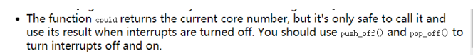
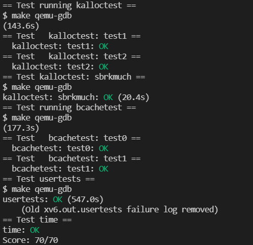

# Lab: Lock

## 1. Memory allocator

In order to achieve concurrency, variables in the program are usually locked to solve the problem of synchronization and mutual exclusion. Locks can provide mutual exclusion, ensuring that only one CPU can hold the lock at the same time, and only one CPU can use the data. The downside of locking is that it reduces performance. Therefore, the purpose of this experiment is to optimize the internal lock of xv6 to improve system performance.

First, we should make sure that each CPU has a kmem to reduce lock contention.

```c
struct {
  struct spinlock lock;
  struct run *freelist;
} kmem[NCPU];
```

We should initial them in `kinit`.

```c
void
kinit()
{
  for (int i = 0; i < NCPU; i++) {
    initlock(&kmem[i].lock, "kmem");
  }
  freerange(end, (void*)PHYSTOP);
}
```

`kfree` should be modified:

```c
void
kfree(void *pa)
{
  struct run *r;

  if(((uint64)pa % PGSIZE) != 0 || (char*)pa < end || (uint64)pa >= PHYSTOP)
    panic("kfree");

  // Fill with junk to catch dangling refs.
  memset(pa, 1, PGSIZE);

  r = (struct run*)pa;

  push_off();
  int id = cpuid();

  acquire(&kmem[id].lock);
  r->next = kmem[id].freelist;
  kmem[id].freelist = r;
  release(&kmem[id].lock);

  pop_off();
}
```

Finally:



```c
void *
kalloc(void)
{
  struct run *r;

  push_off();
  int id = cpuid();
  pop_off();

  acquire(&kmem[id].lock);
  r = kmem[id].freelist;
  if(r) {
    kmem[id].freelist = r->next;
  }
  else {
    // stealing
    struct run* steal;
    for(int i = 0; i < NCPU; i++) {
      if (i == id) continue;
      acquire(&kmem[i].lock);
      steal = kmem[i].freelist;
      if(steal) {
        // steal 666 pages
        for(int j=0; j<666; j++){
        	if(steal->next)
        		steal = steal->next;
        	else
        		break;
        }
        kmem[id].freelist = kmem[i].freelist;
        kmem[i].freelist = steal->next;
        steal->next = 0;
        release(&kmem[i].lock);
        break;
      }
      else{
      	release(&kmem[i].lock);
      	continue;
      }
    }
    r = kmem[id].freelist;
    if(r)
    	kmem[id].freelist = r->next;
  }
  release(&kmem[id].lock);

  if(r)
    memset((char*)r, 5, PGSIZE); // fill with junk
  return (void*)r;
}
```

## 2. Buffer cache

Buffer cache is used to cache data blocks of some disks, which can reduce time-consuming disk read and write operations. To improve performance, a hash table can be used instead of a linked list. In this way, when accessing the hash table, only a certain bucket of the hash table needs to be locked, and there is no need to lock the actual buffer.
		In the original buffer cache, a linked list was used to maintain LRU information, but now a hash table is used instead of a linked list for maintenance, so the prev of the buf structure previously defined in buf.h needs to be removed, and a timestamp is added to record the release time.

```c
struct buf {
  int valid;   // has data been read from disk?
  int disk;    // does disk "own" buf?
  uint dev;
  uint blockno;
  struct sleeplock lock;
  uint refcnt;
  // struct buf *prev; // LRU cache list
  struct buf *next;
  uchar data[BSIZE];

  uint timestamp;
};
```

According to hints, there are cases where two locks are used, because using only one lock will cause a lot of contention. However, if the data block is stored in a hash table according to its block number, and a lock is added to each hash table, the competition will only occur when two processes access blocks in the same bucket at the same time, so will improve performance.

```c
struct {
  struct spinlock lock;
  struct buf buf[NBUF];
} bcache;

struct bucket {
  struct spinlock lock;
  struct buf head;
}hashtable[NBUCKET];
```

Now the hash table needs to be initialized in the binit function. During initialization, each buffer cache actually corresponds to a bucket of the hash table.

```c
void
binit(void)
{
  struct buf *b;

  initlock(&bcache.lock, "bcache");

  for(b = bcache.buf; b < bcache.buf+NBUF; b++){
    initsleeplock(&b->lock, "buffer");
  }

  b = bcache.buf;
  for (int i = 0; i < NBUCKET; i++) {
    initlock(&hashtable[i].lock, "bcache_bucket");
    for (int j = 0; j < NBUF / NBUCKET; j++) {
      b->blockno = i;
      b->next = hashtable[i].head.next;
      hashtable[i].head.next = b;
      b++;
    }
  }
}
```

The core of this lab is `bget`. When looking up whether a memory block is cached, it should return directly if it is already cached. If there is no cache, you need to find a most recently unused block and evict it for replacement. Here, you can search in the current bucket first, and then go to the global search if it is not found in the current bucket. In this way, when there are free blocks in the current bucket, the use of the global lock can be avoided and the competition will be reduced. 

The procedure is:

- Add table level lock.
- Find a block and find the corresponding bucket according to the block information.
- Lock the bucket.
- Remove the block from the bucket's linked list, release the lock, and then add it to the current bucket's linked list.

```c
static struct buf*
bget(uint dev, uint blockno)
{
  // printf("dev: %d blockno: %d Status: ", dev, blockno);
  struct buf *b;

  int idx = hash(blockno);
  struct bucket* bucket = hashtable + idx;
  acquire(&bucket->lock);

  // Is the block already cached?
  for(b = bucket->head.next; b != 0; b = b->next){
    if(b->dev == dev && b->blockno == blockno){
      b->refcnt++;
      release(&bucket->lock);
      acquiresleep(&b->lock);
      // printf("Cached %p\n", b);
      return b;
    }
  }

  // Not cached.
  int min_time = 0x8fffffff;
  struct buf* replace_buf = 0;

  for(b = bucket->head.next; b != 0; b = b->next){
    if(b->refcnt == 0 && b->timestamp < min_time) {
      replace_buf = b;
      min_time = b->timestamp;
    }
  }
  // find
  if(replace_buf) {
    goto find;
  }

  // not found
  acquire(&bcache.lock);
  refind:
  for(b = bcache.buf; b < bcache.buf + NBUF; b++) {
    if(b->refcnt == 0 && b->timestamp < min_time) {
      replace_buf = b;
      min_time = b->timestamp;
    }
  }
  if (replace_buf) {
    // remove
    int ridx = hash(replace_buf->blockno);
    acquire(&hashtable[ridx].lock);
    if(replace_buf->refcnt != 0)  
    {
      release(&hashtable[ridx].lock);
      goto refind;
    }
    struct buf *pre = &hashtable[ridx].head;
    struct buf *p = hashtable[ridx].head.next;
    while (p != replace_buf) {
      pre = pre->next;
      p = p->next;
    }
    pre->next = p->next;
    release(&hashtable[ridx].lock);
    // add block
    replace_buf->next = hashtable[idx].head.next;
    hashtable[idx].head.next = replace_buf;
    release(&bcache.lock);
    // printf("Global %d -> %d %p\n", ridx, idx, replace_buf);
    goto find;
  }
  else {
    panic("bget: no buffers");
  }

  find:
  replace_buf->dev = dev;
  replace_buf->blockno = blockno;
  replace_buf->valid = 0;
  replace_buf->refcnt = 1;
  release(&bucket->lock);
  acquiresleep(&replace_buf->lock);
  return replace_buf;
}
```

Finally, modify `bpin` and `bunpin`.

```c
void
bpin(struct buf *b) {
  int idx = hash(b->blockno);
  acquire(&hashtable[idx].lock);
  b->refcnt++;
  release(&hashtable[idx].lock);
}

void
bunpin(struct buf *b) {
  int idx = hash(b->blockno);
  acquire(&hashtable[idx].lock);
  b->refcnt--;
  release(&hashtable[idx].lock);
}
```

## 3. Result



