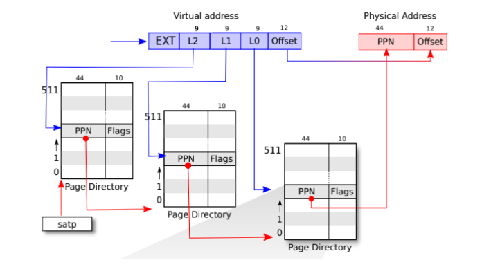
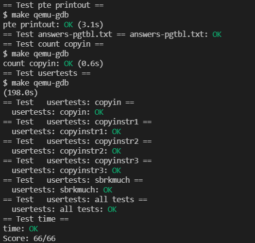

# Lab: page tables

## 1. Print a page table



In xv6, it is a three-level page table, so you can consider using recursive traversal.

```c
// recursive
void vmprint_helper(pagetable_t pagetable, int level)
{
  if(level == 4)
    return;
  for(int i = 0; i < 512; i++){
    pte_t pte = pagetable[i];
    if(pte & PTE_V){
      // this PTE points to a lower-level page table.
      uint64 child = PTE2PA(pte);
      for(int l=0; l<level; l++){
        if(l != 0)
          printf(" ");
        printf("..");
      }
      printf("%d: pte %p pa %p\n", i, pte, child);
      vmprint_helper((pagetable_t)child, level + 1);
    } else if(pte & PTE_V){
      panic("freewalk: leaf");
    }
  }
}

void 
vmprint(pagetable_t pagetable)
{
  vmprint_helper(pagetable, 1);
}


```

Finally add a call to `vmprint` in exec.c. When pid equals to 1, `vmprint` should be called.

```c
  if (p->pid == 1)
  {
    vmprint(pagetable);
  }
```

## 2. A kernel page table per process

xv6 has a separate kernel page table. It is used every time when the kernel executes. In this lab, instead of using the global page table, each process is allocated a kernel page table.

The first thing to do is to add a kernel page table to the `proc` structure.

```c
pagetable_t kpagetable;      // Kernel page table
```


For such kernel page tables, initialization is required. we can initialize kpagetable according to `kvminit(vm.c)`&`proc_pagetable(proc.c)`. Also, the page table needs to be freed at the end. Therefore, it is also necessary to add a page table release function.

We need a function `proc_kvminit` to create a kernel pagetable in process.

Note that don't forget to map trapframe.

```c
pagetable_t
proc_kvminit(struct proc *p)
{
  pagetable_t kpagetable;
  kpagetable = uvmcreate();
  if(kpagetable == 0)
    return 0;

  proc_kvmmap(kpagetable, UART0, UART0, PGSIZE, PTE_R | PTE_W);
  proc_kvmmap(kpagetable, VIRTIO0, VIRTIO0, PGSIZE, PTE_R | PTE_W);
  proc_kvmmap(kpagetable, PLIC, PLIC, 0x400000, PTE_R | PTE_W);
  proc_kvmmap(kpagetable, KERNBASE, KERNBASE, (uint64)etext-KERNBASE, PTE_R | PTE_X);
  proc_kvmmap(kpagetable, (uint64)etext, (uint64)etext, PHYSTOP-(uint64)etext, PTE_R | PTE_W);
  proc_kvmmap(kpagetable, TRAMPOLINE, (uint64)trampoline, PGSIZE, PTE_R | PTE_X);
  proc_kvmmap(kpagetable, TRAPFRAME, (uint64)(p->trapframe), PGSIZE, PTE_R | PTE_W);

  return kpagetable;
}

```

`proc_kvmmap` is a helper function.

```c
// add a mapping to the proc kernel page table.
// only used when booting.
// does not flush TLB or enable paging.
void
proc_kvmmap(pagetable_t pagetable, uint64 va, uint64 pa, uint64 sz, int perm)
{
  if(mappages(pagetable, va, sz, pa, perm) != 0)
    panic("pagetable");
}
```

Free kernel pagetable.

```c
void
proc_freekpagetable(pagetable_t kpagetable)
{
  for (int i = 0; i < 512; i++) {
		    pte_t pte = kpagetable[i];
		    if (pte & PTE_V) {
			      if ((pte & (PTE_R|PTE_W|PTE_X)) == 0) {
				        uint64 child = PTE2PA(pte);
				        proc_freekpagetable((pagetable_t)child);
			      }
		    }
	  }
	  kfree((void*)kpagetable);
}

```

Call `proc_kvminit` in `allocproc` according to hints. The call here is to create the kernel page table and map the kernel page table to the corresponding location.

```c
  p->kpagetable = proc_kpagetable();
  if (p->kpagetable == 0)
  {
    freeproc(p);
    release(&p->lock);
    return 0;
  }
```

After the process switch is performed in the scheduler function, the kernel page table must also be switched, and it needs to be refreshed with `sfence_vam`. When no process is running, switch to kernel pageable.

``` 
w_satp(MAKE_SATP(p->kpagetable));
sfence_vma();
 
... 

kvminithart();
```

The kernel pagetable should be freed in `freeproc`.

```c
static void
freeproc(struct proc *p)
{
  if (p->trapframe)
    kfree((void *)p->trapframe);
  p->trapframe = 0;
  if (p->pagetable)
    proc_freepagetable(p->pagetable, p->sz);

  if (p->kstack)
  {
    pte_t *pte = walk(p->kpagetable, p->kstack, 0);
    if (pte == 0)
      panic("freeproc: walk");
    kfree((void *)PTE2PA(*pte));
  }
  p->kstack = 0;

  if (p->kpagetable)
    proc_freekpagetable(p->kpagetable);

  p->kpagetable = 0;
  p->pagetable = 0;
  p->sz = 0;
  p->pid = 0;
  p->parent = 0;
  p->name[0] = 0;
  p->chan = 0;
  p->killed = 0;
  p->xstate = 0;
  p->state = UNUSED;
}
```

**Note that these are not all codes that need to be modified.**

## 3. Simplify copyin/copyinstr

The previous question is actually the basis for this one. Because the previous copyin function reads the memory pointed to by the user pointer. But now that the kernel page table is established, the address space of the process can be mapped into the kernel page table to simplify copyin. In this way, the copyin function does not need to perform the process of address translation.
	This mapping is possible because the range of user virtual addresses does not coincide with the range of addresses the kernel uses for its own instructions and data. The address space of the Xv6 process starts to grow from 0, and the kernel space is at a higher address, specifically, it starts to grow from PLIC. Therefore, the address space of the process can grow from 0 to PLIC, and here it is necessary to limit the address space of the process in growproc to prevent it from exceeding the PLIC.

In XV6, there are places that involve process page table changes: `fork`, `exec`, `sbrk`, so after changing the process page table, synchronize it to the kernel page table. Create a function first to facilitate copying work.

``` c
void u2kvmcopy(pagetable_t upagetable, pagetable_t kpagetable, uint64 oldsz, uint64 newsz)
{
  pte_t *pte_from, *pte_to;
  uint64 a, pa;
  uint flags;

  if (newsz < oldsz)
    return;
  oldsz = PGROUNDUP(oldsz);
  for (a = oldsz; a < newsz; a += PGSIZE)
  {
    if ((pte_from = walk(upagetable, a, 0)) == 0)
      panic("u2kvmcopy: pte should exist");
    if ((pte_to = walk(kpagetable, a, 1)) == 0) 
      panic("u2kvmcopy: walk fails");
    pa = PTE2PA(*pte_from);
    flags = (PTE_FLAGS(*pte_from) & (~PTE_U));
    *pte_to = PA2PTE(pa) | flags;
  }
}
```

The synchronization of the page table is realized by the above ukvmcopy function. After the above three functions change the page table, this function needs to be called for synchronization.

fork:

```c
u2kvmcopy(np->pagetable, np->kpagetable, 0, np->sz);
```

exec:

```c
u2kvmcopy(pagetable, p->kpagetable, 0, sz);
```

In sbrk, the space is adjusted by calling the growproc function, so the growproc function can be modified directly.
In growproc, the process space will increase or decrease, so a copy between the kernel and the user is also required.

```c
u2kvmcopy(p->pagetable, p->kpagetable, sz - n, sz);
```

userinit:

```c
u2kvmcopy(p->pagetable, p->kpagetable, 0, p->sz);
```

## 4. Result



