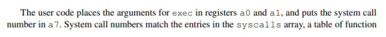

# Lab: system calls

## 1. System call tracing

This lab needs to write some fragmented code, which is a little troublesome, but it can be based on hints.

- `user/usys.pl` add `entry("trace")`
- `kernel/syscall.h` add `#define SYS_trace 22`
- `user/user.h` add trace `int trace(int)`
- `kernel/syscall.c` add `extern uint64 sys_trace(void)`
- `kernel/syscall.c` add `[SYS_trace] sys_trace`

The purpose of trace is to trace system calls. The parameter passed in is a number whose bits indicate which system calls to trace.

For example, to trace fork, just call trace(1<<SYS_fork), then it is equivalent to trace(10b), which traces the system call whose value is 1 in the macro definition. In other words, after the parameter in the trace is converted into binary, the first bit is 1, and the first system call is traced. Since there are a total of 23 system calls(sysinfo), 24-bit space is required. So 32 bits of int type is completely enough.

According to hints, we should save this parameter in the proc structure:

```c
// Per-process state
struct proc {
  struct spinlock lock;

  // p->lock must be held when using these:
  enum procstate state;        // Process state
  struct proc *parent;         // Parent process
  void *chan;                  // If non-zero, sleeping on chan
  int killed;                  // If non-zero, have been killed
  int xstate;                  // Exit status to be returned to parent's wait
  int pid;                     // Process ID

  // these are private to the process, so p->lock need not be held.
  uint64 kstack;               // Virtual address of kernel stack
  uint64 sz;                   // Size of process memory (bytes)
  pagetable_t pagetable;       // User page table
  struct trapframe *trapframe; // data page for trampoline.S
  struct context context;      // swtch() here to run process
  struct file *ofile[NOFILE];  // Open files
  struct inode *cwd;           // Current directory
  char name[16];               // Process name (debugging)
  int mask;                    // For trace syscall
};
```


The value after the system call is stored in p->trapframe->a0, so add the following code to sysproc:

```c
// trace syscall
uint64
sys_trace(void)
{
  int mask;
  if(argint(0, &mask) < 0)
    return -1;
  myproc()->mask = mask;
  return 0;
}
```

The `argint` function returns `p->trapframe->a0` when the first parameter of the argint function is passed in 0. Save the return value of the system call in the mask of the PCB for subsequent use.



Just compare the mask value of the PCB with the value of a7. If the value of mask and (1<<a7) are true after bitwise AND, it means that the currently executed system call is the tracked system call, and its related information can be output.

```c
char *syscall_names[] = {"fork", "exit", "wait", "pipe",
"read","kill", "exec", "fstat", "chdir", "dup", "getpid", "sbrk",
"sleep", "uptime", "open", "write", "mknod", "unlink", "link",
"mkdir", "close", "trace", "sysinfo"};

void
syscall(void)
{
  int num;
  struct proc *p = myproc();
  num = p->trapframe->a7;
  if(num > 0 && num < NELEM(syscalls) && syscalls[num]) {
    // never get mask value before this line
    p->trapframe->a0 = syscalls[num]();
    if(p->mask & (1 << num)){
      printf("%d: syscall %s -> %d\n", p->pid, syscall_names[num-1], p->trapframe->a0);

    }
  } else {
    printf("%d %s: unknown sys call %d\n",
            p->pid, p->name, num);
    p->trapframe->a0 = -1;
  }
}

```

Note that if you want to trace `syscall trace`, you cannot get the mask value before the line `p->trapframe->a0 = syscalls[num]();` , because mask is assigned after this line.

It should also be noted that in fork, the child process needs to copy the mask value of the parent process.

```c
np->mask = p->mask;
```

## 2. Sysinfo

Refer to System call tracing.

- `user/usys.pl` add `entry("sysinfo")`
- `kernel/syscall.h` add `#define SYS_sysinfo 23`
- `kernel/syscall.c` add `extern uint64 sys_sysinfo(void)`
- `kernel/syscall.c` add `[SYS_sysinfo] sysinfo`

In this lab, sysinfo needs to collect information including the free memory and the number of UNUSED processes. This information is stored in a sysinfo structure. There is a definition of this structure in sysinfo.h:

```c
struct sysinfo {
	uint64 freemem; // amount of free memory (bytes)
	uint64 nproc; // number of process
};
```

Therefore, you need to add the sysinfo structure and the function declaration of sysinfo in user.h:

```c
struct sysinfo;
int sysinfo(struct sysinfo *);
```

First solve the calculation of the amount of free memory, add the function `freemem` to kalloc. For `kmem.freelist`, as long as it is true or not null, it means that there is still free memory. The size of each free memory is defined by the PGSIZE macro.

```c
// collect the amount of free memory
uint64 get_freemem(void){
  struct run *r;
  uint64 freemem_cnt = 0;
  acquire(&kmem.lock);
  r = kmem.freelist;
  while(r){
    freemem_cnt += PGSIZE;
    r = r->next;
  }
  release(&kmem.lock);
  return freemem_cnt;
}

```

Count the number of states whose state attribute is UNUSED in the process:

```c
// collect the number of processes
uint64 get_unusedproc(void){
  uint64 unusedproc = 0;
  struct proc *p;
  for(p = proc; p < &proc[NPROC]; p++){
    if(p->state != UNUSED)
      unusedproc++;
  }
  return unusedproc;
}
```

Call the `freemem` and `proc_count` functions to obtain the required values. sysinfo needs to copy a struct sysinfo to the user space, so the `copyout` function needs to be used. According to the prompt, look at the source codes of the two functions `sys_fstat (kernel/sysfile.c)` and `filestat (kernel/file.c)` to learn how to use the copyout function.

```c
uint64 sys_sysinfo(void)
{
  uint64 addr;
  if(argaddr(0, &addr) < 0)
    return -1;
  struct proc *p = myproc();
  struct sysinfo info;
  info.freemem = get_freemem();
  info.nproc = get_unusedproc();
  if(copyout(p->pagetable, addr, (char *)&info, sizeof(info)) < 0)
    return -1;
  return 0;
}

```

## 3. result

